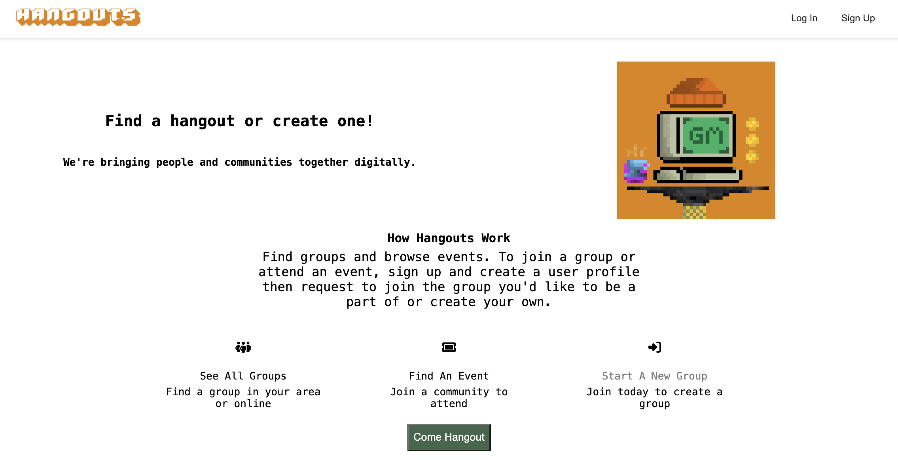
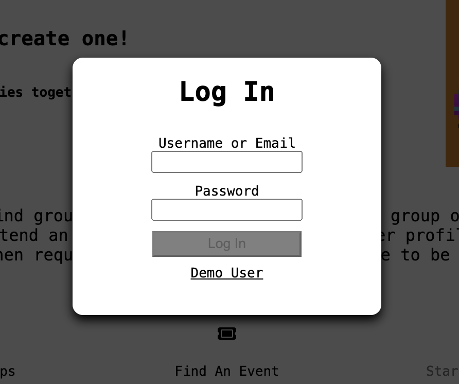
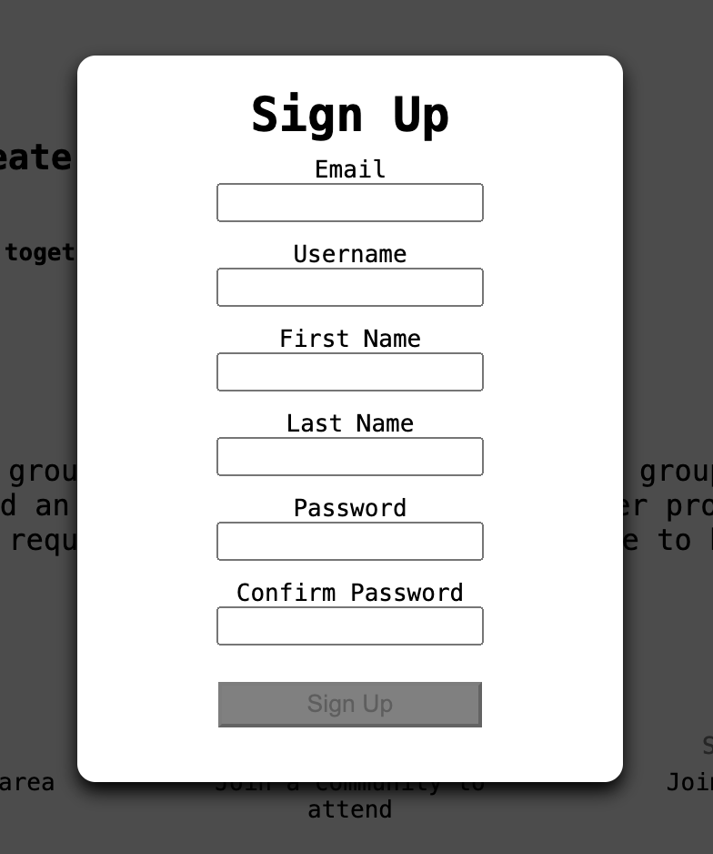
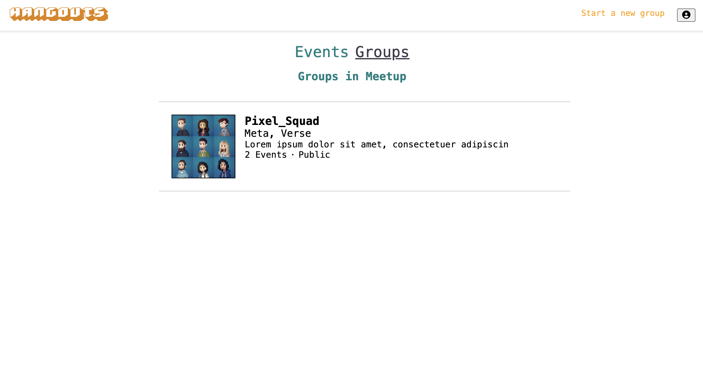
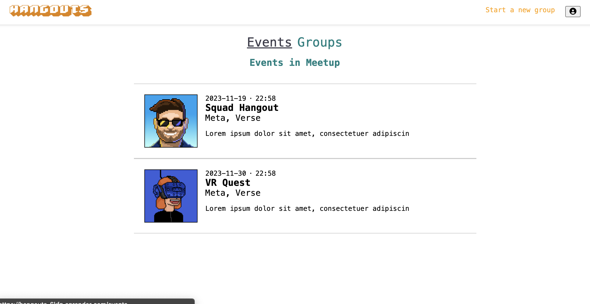
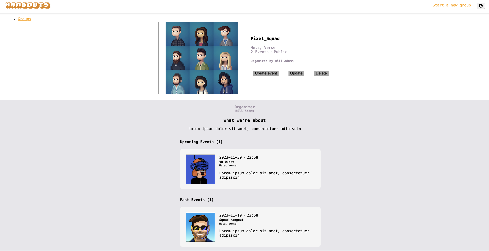
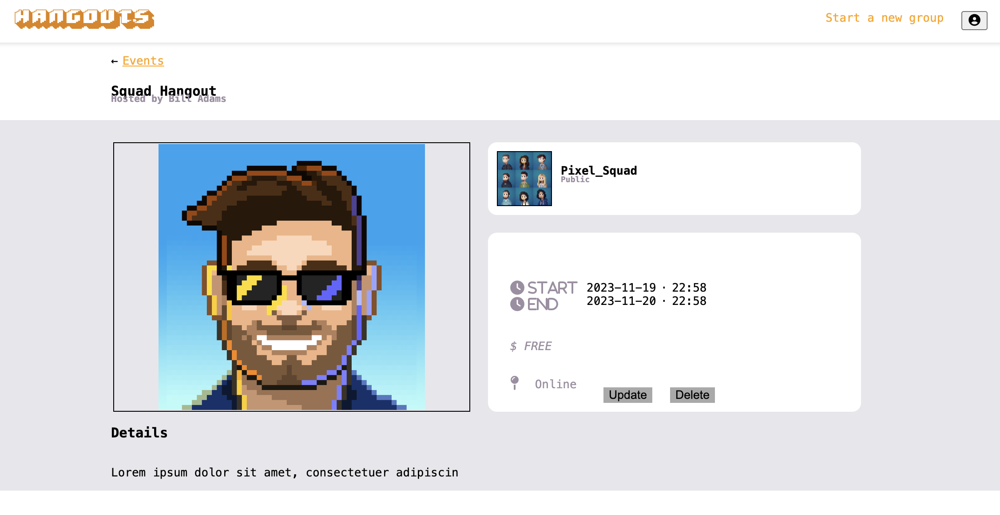

### Link to live site [here](https://hangouts-6kfn.onrender.com/)

## Description

Hangouts is web application designed to allow users to create groups and events for their local or online communities. Hangouts is a clone of meetup.com

## Technologies

<br>
<p float="left">

 
  &nbsp;
  
  &nbsp;
  
  &nbsp;
  
  &nbsp;
  
  &nbsp;
  
  &nbsp;
</p>

## Getting Started Locally

1. Clone repo:

   ```
   https://github.com/milomadeit/hangouts_project.git
   ```

2. Install dependencies (backend) -
   CD into backend and run the following:

   ```
   npm install
   ```

3. Create an .env file in the backend that looks like this:

   ```
   PORT=8000
   NODE_ENV=development
   DB_FILE=db/dev.db
   JWT_SECRET=3ab670d8428c97ca3e93214697cb4a5c
   JWT_EXPIRES_IN=604800
   SCHEMA=hangouts_project_schema
   ```

4. Run migrations and seeds for backend:

   ```
   npx dotenv sequelize db:migrate
   npx dotenv sequelize dp:seed:all
   ```

5. Install dependencies (frontend):

   ```
   npm install
   ```

6. After installing dependencies and running migrations please run the following command in BOTH the backend and then the frontend folder:

   ```
   npm start
   ```

   This will start the server for the backend and the front end on different ports (8000 and 3000 respectively)

7. Your browser should be opened and running Hangouts locally. If not, navigate to http://localhost:3000.

## Features

### Current Features:

- Users can create an account or log in with the Demo user.
- Users can create, update, and delete groups.
- Users can create and delete events.
- Users can request to join an event if they are a member of the group (feature coming soon)
- Unauthenticated users can view current groups and events but cannot join a group or request to attend an event until signed up and a member.

### Future Features

- Users can update an event they created
- Creating a 'My Events' and 'My Groups' pages
- Would like to update the authentication to web3/wallet authentication for new a returning users utilizing thirdweb's Auth
- Continue to refine UI design.


## Screenshots










## Database Schema and API

Information on how the database is set up and the current API routes for the application can be found in the backend folder's readme or in the [github wiki]()
